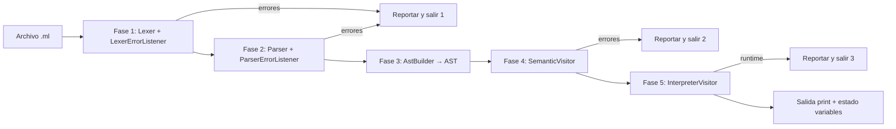

# Informe — Pipeline MiniLang (base para PDF)

## Carátula (completar a mano)

- **Proyecto / curso:** Compiladores — MiniLang  
- **Fecha:** _______________  
- **Participación (% por integrante):**  
  - Nombre 1: ____%  
  - Nombre 2: ____%  
  - …

---

## Diagrama de flujo del pipeline



**Implementación:** `src/pipeline.py` (una sola lectura UTF-8 del archivo; `InputStream` para lexer y parser).

---

## Capturas de pantalla (pegar aquí al exportar a PDF)

Ejecutar desde la raíz del repo (con `venv` activo y dependencias instaladas):

```bash
python -m src.pipeline tests/test_error_lexico.ml
python -m src.pipeline tests/test_error_sintactico.ml
python -m src.pipeline tests/test_error_semantico.ml
```

1. **Error léxico** — salida `[Error Léxico] ...`  
2. **Error sintáctico** — salida `[Error Sintáctico] ...`  
3. **Error semántico** — salida `[Error Semántico] ...`  

Programa válido de referencia:

```bash
python -m src.pipeline tests/test_valido.ml
```

---

## Casos de prueba (`tests/`)

| Archivo | Qué valida |
|---------|------------|
| `test_valido.ml` | Funciones, `while`, bloque anidado, `print` |
| `test_error_lexico.ml` | Símbolos inválidos (`@`, `#`) |
| `test_error_sintactico.ml` | `;` faltante, `(` sin cerrar |
| `test_error_semantico.ml` | Tipos, variable no declarada, argumentos de función |

---

## Regenerar analizador ANTLR

Ver `tools/regenerate_parser.ps1` o:

```bash
java -jar tools/antlr-4.13.1-complete.jar -Dlanguage=Python3 -visitor -no-listener -o gen/grammar grammar/MiniLang.g4
```

---

## Exportar este documento a PDF

- **VS Code:** extensión “Markdown PDF” → exportar.  
- **Navegador:** imprimir → “Guardar como PDF”.  
- **Pandoc:** `pandoc docs/ENTREGA_PIPELINE.md -o informe.pdf`
