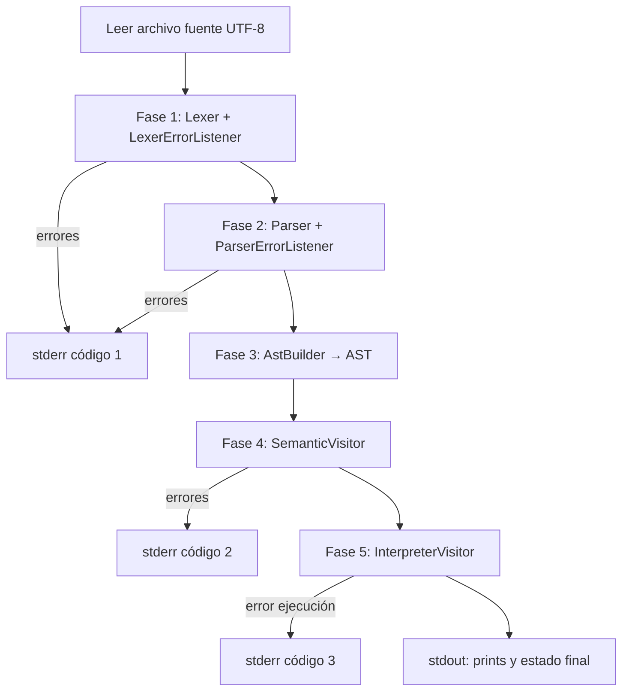

**Descarga desde GitHub:** [Markdown raw](https://raw.githubusercontent.com/SergioLSantosR/Compiladores/main/docs/INFORME_COMPILADORES.md) · [HTML para imprimir/PDF](https://raw.githubusercontent.com/SergioLSantosR/Compiladores/main/docs/INFORME_COMPILADORES.html) · [Guía de enlaces](DESCARGAR_INFORME.md)

---

<div align="center">

# UNIVERSIDAD DE SAN CARLOS DE GUATEMALA

**Región Metropolitana**

**Facultad de Ingeniería en Sistemas de Información**

**Curso:** Compiladores  

**Sección:** B  

**Ciclo:** 7  

**Proyecto 1**

---

## Informe técnico — MiniLang

**Pipeline de compilación (léxico, sintáctico, semántico e intérprete)**  
Repositorio: [Compiladores](https://github.com/SergioLSantosR/Compiladores) (GitHub)

---

### Integrantes

| Nombre completo | Carné | % participación |
|-----------------|-------|-----------------|
| Julio Alexander Alvarado Morales | 7690-23-13706 | |
| Jonathan Joel Istupe Martinez | 7690-23-15804 | |
| Sergio Leonel Santos Ruano | 7690-23-433 | |
| Juan Jose Marroquin Aquino | 7690-23-16390 | |
| Emerson Steve Alvizures Palma | 7690-23-12526 | |

*Completar el porcentaje de participación (0 % – 100 % por integrante; la suma debe ser 100 %).*

**Fecha de entrega:** 11 de marzo de 2026

</div>

---

## Índice

1. [Resumen ejecutivo](#1-resumen-ejecutivo)  
2. [Objetivos](#2-objetivos)  
3. [Descripción del repositorio Git](#3-descripción-del-repositorio-git)  
4. [Arquitectura del proyecto](#4-arquitectura-del-proyecto)  
5. [Lenguaje MiniLang](#5-lenguaje-minilang)  
6. [Gramática ANTLR](#6-gramática-antlr)  
7. [Pipeline de compilación](#7-pipeline-de-compilación)  
8. [Manejo de errores](#8-manejo-de-errores)  
9. [Árbol de sintaxis abstracta (AST)](#9-árbol-de-sintaxis-abstracta-ast)  
10. [Análisis semántico y ámbitos](#10-análisis-semántico-y-ámbitos)  
11. [Intérprete](#11-intérprete)  
12. [Casos de prueba](#12-casos-de-prueba)  
13. [Cumplimiento frente al enunciado (Proyecto 2)](#13-cumplimiento-frente-al-enunciado-proyecto-2)  
14. [Instrucciones de ejecución](#14-instrucciones-de-ejecución)  
15. [Conclusiones](#15-conclusiones)  
16. [Referencias](#16-referencias)  

---

## 1. Resumen ejecutivo

Este documento describe el estado del proyecto **MiniLang** alojado en el repositorio Git **Compiladores**: un front-end de compilación con **ANTLR4** y **Python** que implementa un **pipeline** secuencial (lectura del fuente → análisis léxico → análisis sintáctico → construcción del **AST** → validación **semántica** → **interpretación**), deteniéndose ante errores en cada fase. El lenguaje soporta tipos `int` y `bool`, estructuras de control `if`/`else`, bucle **`while`**, **funciones** con `return` y **llamadas**, e impresión con **`print`**. Los errores léxicos y sintácticos se formatean mediante **listeners** personalizados; la semántica valida tipos, declaraciones, ámbitos y firmas de funciones; el intérprete ejecuta el AST y muestra resultados en consola.

---

## 2. Objetivos

- **General:** Evolucionar el analizador del curso hacia un pipeline completo con intérprete, según la línea del enunciado *Proyecto 2 Compiladores 2026* (front-end + ejecución con `print`).
- **Específicos:**
  - Orquestar en `pipeline.py` las fases en orden estricto.
  - Reportar errores léxicos, sintácticos y semánticos con línea y columna.
  - Extender la gramática con `while`, `func`, `return` y llamadas.
  - Gestionar ámbitos mediante una **pila de tablas hash** (`list` de `dict` en Python).
  - Proporcionar casos de prueba y documentación exportable a PDF.

---

## 3. Descripción del repositorio Git

| Elemento | Descripción |
|----------|-------------|
| **Remoto** | `https://github.com/SergioLSantosR/Compiladores.git` |
| **Rama principal** | `main` (integración estable) |
| **Ramas de trabajo** | Se utilizó `feature/integracion-pipeline` para desarrollo y merge a `main` (estrategia documentada en `docs/GIT_WORKFLOW.md`). |
| **Historial** | Commits descriptivos (por ejemplo: integración del pipeline, gramática extendida, pruebas y documentación). |
| **Contenido versionado** | Gramática `.g4`, código generado en `gen/grammar/`, módulos Python en `src/`, ejemplos en `examples/`, pruebas en `tests/`, scripts en `tools/`, documentación en `docs/`. |
| **Excluido del repo** | Entorno virtual `.venv/`, JAR de ANTLR en `tools/` (se descarga con el script de regeneración). |

---

## 4. Arquitectura del proyecto

Estructura de directorios relevante:

```
Compiladores/
├── grammar/
│   └── MiniLang.g4          # Gramática léxica y sintáctica
├── gen/grammar/             # Lexer, parser y visitor generados por ANTLR
├── src/
│   ├── pipeline.py          # Orquestación del pipeline
│   ├── custom_errors.py     # LexerErrorListener y ParserErrorListener
│   ├── ast_nodes.py         # Nodos del AST
│   ├── ast_builder.py       # Visitor: parse tree → AST
│   ├── semantic_visitor.py  # Validación semántica y tipos
│   ├── interpreter_visitor.py  # Ejecución
│   ├── run.py               # Entrada: delega en pipeline
│   ├── EvalVisitorImpl.py   # Compatibilidad (delega en AST + intérprete)
│   └── error_listener.py    # Listener legacy (Verbose)
├── examples/                # Programas de ejemplo
├── tests/                   # Casos válido / error léxico, sintáctico, semántico
├── tools/
│   └── regenerate_parser.ps1
├── requirements.txt
├── README.md
└── docs/
    ├── ENTREGA_PIPELINE.md
    ├── GIT_WORKFLOW.md
    └── INFORME_COMPILADORES.md   # Este informe
```

### Diagrama de flujo del pipeline



---

## 5. Lenguaje MiniLang

| Característica | Soporte actual |
|----------------|----------------|
| Tipos | `int`, `bool` |
| Programa | `program { ... }`; funciones opcionales al inicio del cuerpo, luego sentencias |
| Declaración | `tipo identificador;` |
| Asignación | `identificador = expresión;` |
| Condicional | `if (expr) { ... }` y `else { ... }` opcional |
| Bucle | `while (expr) { ... }` (condición booleana) |
| Funciones | `func tipo nombre(params) { ... }`, `return expr;`, llamada `nombre(args)` como expresión |
| Salida | `print(expr);` |
| Operadores | Aritméticos `+ - * /` (enteros), relacionales, igualdad `==` / `!=` / `<>`, lógicos `&&`, `||`, `!` |

---

## 6. Gramática ANTLR

- Archivo: **`grammar/MiniLang.g4`**.
- Generación: ANTLR 4 con **visitor** activado y **listener** desactivado en el generador, por ejemplo:

  ```bash
  java -jar antlr-4.13.1-complete.jar -Dlanguage=Python3 -visitor -no-listener -o gen/grammar grammar/MiniLang.g4
  ```

- Salida: `MiniLangLexer.py`, `MiniLangParser.py`, `MiniLangVisitor.py` en `gen/grammar/`.

---

## 7. Pipeline de compilación

El módulo **`src/pipeline.py`** implementa el flujo exigido:

1. **Lectura** del código fuente (una lectura UTF-8 del archivo).  
2. **Lexer:** recorre todos los tokens; si el `LexerErrorListener` acumula errores, se imprimen y termina con código **1**.  
3. **Parser:** construye el árbol de análisis; si el `ParserErrorListener` tiene errores, código **1**.  
4. **AST:** `AstBuilder` recorre el árbol ANTLR y produce nodos en `ast_nodes.py`.  
5. **Semántica:** `SemanticVisitor` analiza el AST; si hay errores, código **2**.  
6. **Intérprete:** `InterpreterVisitor` ejecuta; errores de ejecución, código **3**. Éxito: código **0**.

La entrada alternativa **`python -m src.run archivo.ml`** delega en el mismo `run_pipeline`.

---

## 8. Manejo de errores

Implementación en **`src/custom_errors.py`**:

| Tipo | Formato (referencia) |
|------|------------------------|
| Léxico | `[Error Léxico] Línea L, Columna C: Símbolo no reconocido '…'` |
| Sintáctico | `[Error Sintáctico] Línea L, Columna C: Se esperaba '…' pero se encontró '…'` (según mensaje ANTLR) |
| Semántico | `[Error Semántico] Línea L, Columna C: …` (mensaje descriptivo) |

La columna mostrada al usuario es **1-based** (se suma 1 a la columna 0-based de ANTLR).

---

## 9. Árbol de sintaxis abstracta (AST)

- Definición de nodos: **`src/ast_nodes.py`** (programa, bloques, declaraciones, asignaciones, `if`, `while`, `print`, `return`, expresiones, llamadas a función).  
- Construcción: **`src/ast_builder.py`** (subclase del `MiniLangVisitor` generado).

---

## 10. Análisis semántico y ámbitos

- **`src/semantic_visitor.py`** recorre el AST **sin ejecutar** el programa.  
- Comprueba: variables declaradas, tipos compatibles en asignaciones y operadores, condiciones `bool` en `if`/`while`, `return` solo dentro de funciones y coherencia con el tipo de retorno, llamadas con **número y tipos** de argumentos correctos.  
- **Ámbitos:** se utiliza una **pila de tablas hash** implementada como **`list` de `dict`** (`self.scopes`): cada bloque nuevo empuja un diccionario; las búsquedas recorren de adentro hacia afuera; la redeclaración en el **mismo** bloque se rechaza.  
- *Nota del enunciado:* el documento oficial menciona un archivo `symbol_table.py`; en esta implementación la pila de ámbitos está **integrada en el visitor semántico** (y el intérprete mantiene su propia pila de entornos para valores en ejecución). Una refactorización futura puede extraer un módulo `symbol_table.py` sin cambiar la semántica.

---

## 11. Intérprete

- **`src/interpreter_visitor.py`** evalúa el AST si la fase semántica no reportó errores.  
- Usa una pila de diccionarios para **variables** en tiempo de ejecución; maneja **llamadas a función** (incluida recursión) y señales de retorno internas.  
- Ejecuta `print` hacia la consola y puede acumular salida en una lista para pruebas.

---

## 12. Casos de prueba

Ubicación: **`tests/`**

| Archivo | Propósito |
|---------|-----------|
| `test_valido.ml` | Programa con funciones, `while`, variable en bloque anidado y `print` |
| `test_error_lexico.ml` | Caracteres inválidos (`@`, `#`) |
| `test_error_sintactico.ml` | Estructura mal formada (`;` faltante, paréntesis sin cerrar) |
| `test_error_semantico.ml` | Tipos incompatibles, variable no declarada, argumentos incorrectos en llamada |

El script **`tests/run_tests.ps1`** ejecuta el pipeline sobre estos archivos y comprueba códigos de salida esperados.

**Capturas para el PDF:** ejecutar los tres casos de error y el válido según `docs/ENTREGA_PIPELINE.md`, capturar la terminal y pegar las imágenes en la versión final del informe.

---

## 13. Cumplimiento frente al enunciado (Proyecto 2)

Alineación con *Enunciado Proyecto 2 Compiladores 2026* (referencia):

| Requisito | Estado |
|-----------|--------|
| Pipeline ordenado (lexer → parser → AST → semántica → intérprete) | Cumplido (`pipeline.py`) |
| ErrorListeners personalizados léxico/sintáctico | Cumplido (`custom_errors.py`) |
| Errores semánticos con línea/columna | Cumplido (`semantic_visitor.py`) |
| Parada ante fallo léxico/sintáctico | Cumplido |
| `while` | Cumplido |
| Funciones con parámetros, `return`, llamadas | Cumplido |
| `print` | Cumplido |
| Pila de tablas hash para scopes | Cumplido (listas de `dict`) |
| Tipos `int` y `bool` | Cumplido |
| Tipos `float`, `string` | **No implementados** en la gramática actual |
| Ciclo `for` | **No implementado** (solo `while`) |
| Archivo dedicado `symbol_table.py` | **No**; lógica equivalente en visitors (mejora futura) |
| Entorno WSL / VS Code | Herramienta de equipo; el código es portable a Windows/Linux |

---

## 14. Instrucciones de ejecución

```bash
# Dependencias
pip install -r requirements.txt

# Pipeline sobre un programa
python -m src.pipeline tests/test_valido.ml
python -m src.pipeline examples/programa1.ml

# Regenerar analizador ANTLR (requiere Java y el JAR descargado por tools/regenerate_parser.ps1)
# En Windows PowerShell:
.\tools\regenerate_parser.ps1
```

---

## 15. Conclusiones

Se entregó un **pipeline completo** para MiniLang con separación clara de fases, manejo uniforme de errores y soporte de **funciones**, **while** y **ámbitos anidados** mediante una pila de diccionarios. El repositorio Git concentra la gramática, el código generado, los visitors y las pruebas automatizables. Las extensiones pendientes respecto al enunciado completo (tipos adicionales, `for`, módulo explícito de tabla de símbolos) pueden abordarse como trabajo futuro sin invalidar la arquitectura actual.

---

## 16. Referencias

- Parr, T. *The Definitive ANTLR 4 Reference*.  
- Documentación ANTLR4: [https://www.antlr.org/](https://www.antlr.org/)  
- Repositorio del proyecto: [https://github.com/SergioLSantosR/Compiladores](https://github.com/SergioLSantosR/Compiladores)  
- Enunciado interno del curso: *Enunciado Proyecto 2 Compiladores 2026* (PDF).

---

*Fin del informe.*
